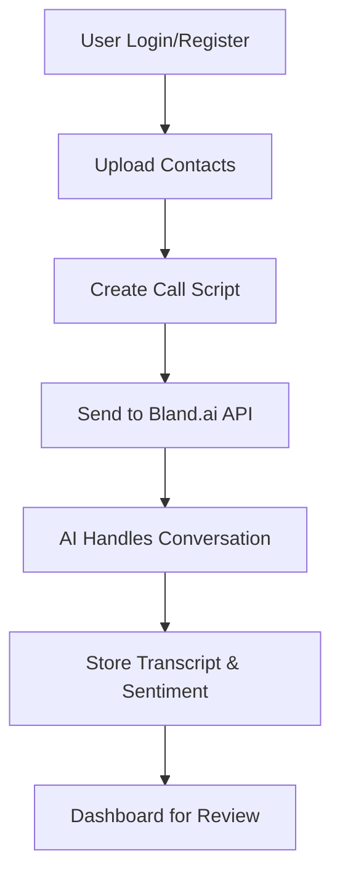

# 🤖 AI-Powered Voice Calling Agent

> 🚀 A full-stack AI-driven platform that uses **Bland.ai** for real-time voice calls and **Gemini API** for intelligent NLP responses — automating outreach, conversations, and sentiment analysis.


---

## ✨ Features
- 🔐 **Secure Authentication** — JWT-based sign-up and login
- 📂 **Flexible Contacts Input** — Upload via CSV or manual entry
- 🗣 **Custom AI Call Scripts** — Create engaging, personalized call flows
- 📞 **Automated Mass Calling** — Trigger calls to multiple recipients at once
- 📝 **Call History & Transcripts** — Store, search, and review past calls
- 😊 **Sentiment Analysis** — AI-powered emotional tone detection

---

## 🛠 Tech Stack

**Frontend**
- ⚛️ React + TypeScript
- 🎨 Tailwind CSS
- 🔗 Axios

**Backend**
- 🟢 Node.js + Express
- 🍃 MongoDB + Mongoose
- 🔑 JWT Authentication

**External APIs**
- 🎤 [Bland.ai](https://bland.ai/) — Text-to-Speech, Speech-to-Text, and call handling
- 🧠 [Gemini API](https://ai.google.dev/) — Natural language understanding & response generation

---

## 📂 Project Structure
```

ai-calling-agent/
├── backend/        # Express server, API routes, and integrations
├── client/         # React + Tailwind frontend
├── .env.example    # Environment variable template
├── docker-compose.yml
└── README.md

````

---

## 🚀 Getting Started

### Prerequisites
- 📌 Node.js v14+  
- 📌 MongoDB (local or Atlas)  
- 📌 Docker (optional)  

---

### ⚙️ Environment Variables

Copy `.env.example` to `.env` and update:
```bash
cp .env.example .env
````

```env
MONGODB_URI=your_mongo_connection_string
JWT_SECRET=your_jwt_secret
BLAND_API_KEY=your_bland_api_key
GEMINI_API_KEY=your_gemini_api_key
```

---

### 📦 Installation

#### Without Docker

```bash
# Backend
cd backend
npm install
npm start

# Frontend
cd client
npm install
npm start
```

#### With Docker

```bash
docker-compose up --build
```

---

## 📡 API Endpoints

### Authentication

| Method | Endpoint             | Description         |
| ------ | -------------------- | ------------------- |
| POST   | `/api/auth/register` | Register a new user |
| POST   | `/api/auth/login`    | Login & get JWT     |
| GET    | `/api/auth/me`       | Fetch user profile  |

### Calls

| Method | Endpoint                   | Description           |
| ------ | -------------------------- | --------------------- |
| POST   | `/api/call/start`          | Start a new AI call   |
| GET    | `/api/call/history`        | Retrieve call history |
| POST   | `/api/call/upload-numbers` | Upload CSV contacts   |

### Webhooks

| Method | Endpoint             | Description                 |
| ------ | -------------------- | --------------------------- |
| POST   | `/api/webhook/bland` | Handle Bland.ai call events |

---

## 🎯 Workflow Overview



---

## 🙌 Contributing

Pull requests are welcome! Please open an issue before major changes.

---

## ⭐ Support

If you like this project, give it a star ⭐ and share it with others!
```
